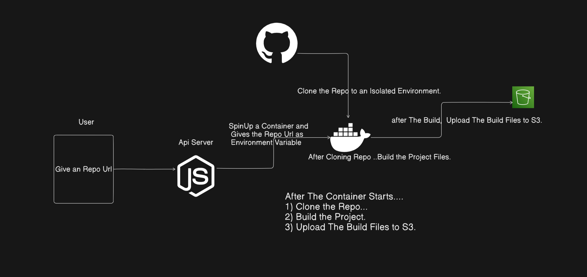

# 🚀 KoDeploy – A Vercel-Like Deployment Platform

A learning-focused project where I build a simplified version of **Vercel**, the popular frontend cloud platform for developers. This project aims to help me understand and implement the core concepts behind modern CI/CD, serverless deployment, and edge infrastructure.

---

## 🎯 Goals

- Recreate core functionality similar to Vercel:
  - Git-based auto-deployments
  - Custom domain routing
  - Edge deployment (experimental)
  - Static site hosting (e.g. React)
- Build full-stack infrastructure from scratch
- Learn about:
  - Docker
  - CI/CD pipelines
  - File systems and caching
  - DNS and TLS management
  - Scalable architecture patterns

---

## 🏗️ Tech Stack (Planned / In Progress)

| Layer         | Tool / Tech               |
|--------------|---------------------------|
| Frontend      | React                      |
| Backend       | Node.js / Express          |
| Deployment    | Docker, GitHub Webhooks   |
| Serverless    | Custom runtime or OpenFaaS |
| Reverse Proxy | Nginx or Traefik          |
| Database      | PostgreSQL / Redis        |
| Storage       | S3-compatible (MinIO)     |
| Domain Mgmt   | Let's Encrypt, CNAME/A DNS |
| Hosting       | DigitalOcean / Localhost  |

---

# Build Server Approach...

## 🔧 Features (MVP Scope)

- [1] Connect GitHub repo and auto-deploy on push
- [2] View deployment logs
- [3] Environment variable support
- [4] Simple dashboard for deployments

